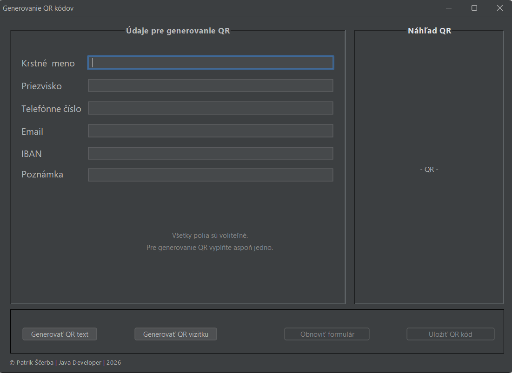
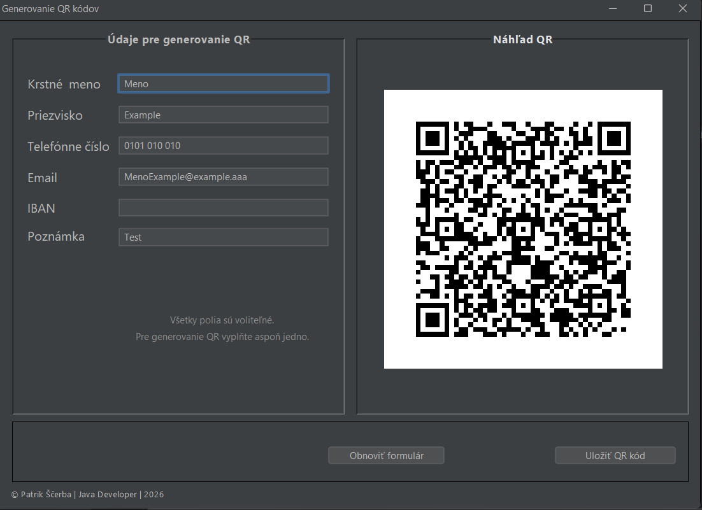
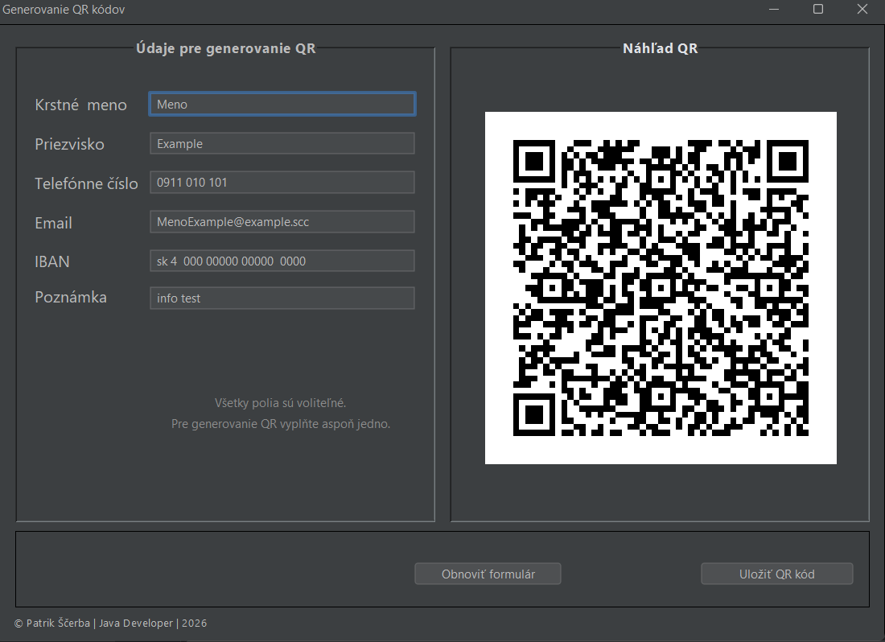

# QR Generátor (Java / Swing)

Jednoduchá desktopová aplikácia v Jave (Swing) na generovanie a ukladanie QR kódov z textu alebo vizitky (vCard formát).
Projekt demonštruje prácu so Swing GUI, generovanie QR pomocou ZXing a export obrázku na disk.
---

## 🚀 Funkcionality
- Generovanie QR kódu z ľubovoľného textu
- Náhľad QR kódu priamo v aplikácii
- Uloženie QR kódu ako obrázka (PNG)
- Podpora slovenskej diakritiky (UTF-8)
- Jednoduché a prehľadné UI (rozloženie, texty, zarovnanie)
---

## 🧩 Režimy generovania QR 
Aplikácia podporuje **2 spôsoby generovania QR kódu**:

### 1. QR z textu
- ľubovoľný text
- URL odkazy
- Poznámky
- Identifikátory
- Interné kódy

QR kód obsahuje presne text, ktorý používateľ zadá.
---

### 2. QR ako vizitka (kontakt)
QR kód obsahuje štruktúrované kontaktné údaje, napr:

- Meno a priezvisko
- Telefón
- Email
- Poznámka / firma

Po naskenovaní sa kontakt môže uložiť priamo do mobilu.
---

## 🛠️ Použité technológie
- **Java 21 (LTS)**
- **Swing (GUI)**
- **FlatLaf (Look & Feel)**
- **ZXing (QR generovanie)**
---

## 📸 Ukážky aplikácie

### Vizualizácia desktopovej aplikácie – QR generovanie

#### Používateľské rozhranie (formulár)


#### Generovanie QR vizitky (vCard)


#### Generovanie QR kódu s textovým obsahom (poznámka)

---

## 🗂 Štruktúra projektu
```src/
sk.patrikscerba
│
├── app
│   ├── QrApp.java
│   ├── QrServis.java
│   └── QrUkladanieServis.java
│
└── ui
    └── QrKod
        ├── QrKod.java
        └── QrKod.form
```
---

## 🧪 Testovanie

### Aplikácia bola testovaná ako desktopová aplikácia

### Testované scenáre:

- Generovanie QR vizitky  
  (naskenovanie a uloženie kontaktu do mobilného telefónu)


- Generovanie QR ako text
  (naskenovanie a zobrazenie obsahu QR kódu)

### Testované prostredie
- **Operačný systém:** Windows 11
- **JDK:** Temurin JDK 21
- **IDE:** IntelliJ IDEA
- **Build nástroj:** Launch4j
---

## 🚀 Spustenie aplikácie
### 1. vývojárske prostredie (zdrojový kód)

### Požiadavky
- IntelliJ IDEA JDK 21

###  Klonovanie projektu
Projekt si stiahnete cez Git:

- **git clone https://github.com/PatrikScerba/qr-generator.git**

### 2. Ako .exe aplikácia (pre používateľov)
### Požiadavky
- **Operačný systém:** Windows (testované na Windows 10 a 11)
- **JDK/JRE:** verzia 21 

Ak Java nie je nainštalovaná, je možné ju stiahnuť z oficiálnej stránky:
**[https://adoptium.net](https://adoptium.net/temurin/releases?version=21&os=any&arch=any)**

## 📥 Stiahnutie aplikácie

- **[Stiahnuť Qr_App – Verzia 1.0.0](https://github.com/PatrikScerba/qr-generator/releases/tag/v1.0.0)**


Aplikácia sa spúšťa dvojklikom na súbor `.exe`.
---

### Cieľ portfólia

Tento projekt je súčasťou môjho osobného portfólia.
Projekt bol vytvorený s cieľom:

- Precvičiť Swing GUI
- Naučiť sa prácu s obrázkami
- Oddeliť logiku od UI
- Vytvoriť znovupoužiteľný QR modul
---

### Autor
**Patrik Ščerba**  
Java Developer (Junior) |Java • Swing | © 2026


